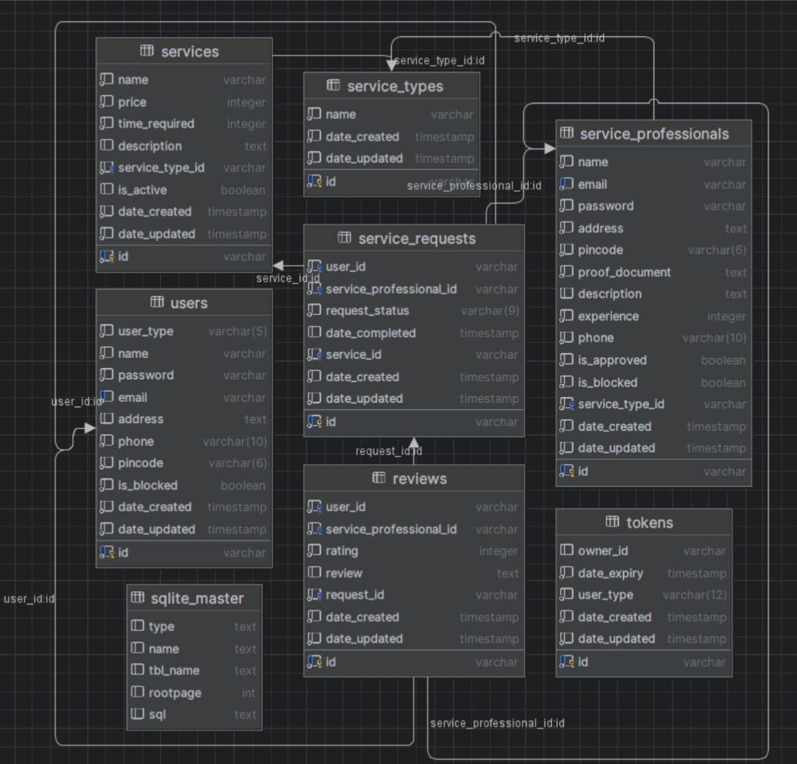

# Houc

Houc serves as a complete ecosystem that connects service professionals with customers seeking their expertise. The platform streamlines the process of finding, vetting, and booking service professionals.

## Technology Stack

### Backend

- **Flask**: Provides the API framework
- **SQLite**: Database management
- **SQL Alchemy**: Object-Relational Mapping
- **Redis**: Used for caching and serving as a queue broker
- **Celery**: Queue management

### Frontend

- **VueJS**: JavaScript framework for UI development
- **CSS**: Styling

### Security

- **JWT tokens**: Authentication and authorization

## Architecture

The project implements a Model-View-Controller (MVC) architecture with a clear separation of concerns:

- API functions are distributed between controller and service files
- Routes direct requests to controllers, where authentication is verified
- Unauthorized requests (missing authentication tokens) return a 401 error
- Service professionals require approval before they can offer services

## User Categories

The application distinguishes between three user types:

1. **Customer**: End users seeking services
2. **Service Professional**: Individuals or businesses offering services
3. **Admin**: System administrators with oversight capabilities

Each user type has a dedicated login interface.

## Admin Panel

The admin panel provides comprehensive monitoring capabilities:

- User management across all categories
- Statistical visualizations and charts
- Ability to block or unblock entities

## API Structure

The API is organized into three controller categories, each with dedicated controller and service files:

1. **Admin Controller**: `/manage` routes
2. **User Controller**: `/user` routes
3. **General Controller**: `/general` routes

Flask's blueprint functionality is utilized to integrate these controllers.

## Database

The project uses an SQLite database (`household.db`) located in the `database` folder within the Python directory.

The database consists of 8 tables (database diagram available in the original documentation).

